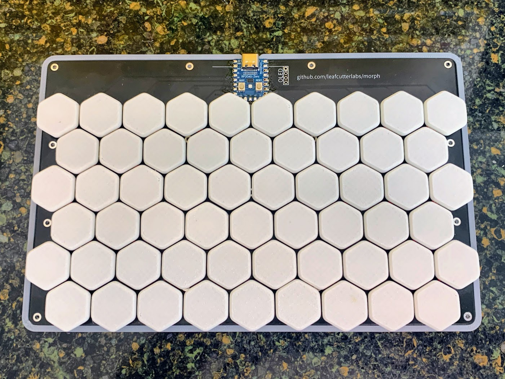

# nope1
Wicki–Hayden midi keyboard powered by RP2040. 

Current QMK Vial firmware is very basic (LEDs are not working) 
 ToDo: 
 	-Get Vial LED control working with backlight 
	-Design additional texture for keycaps to designate sharps/flats/etc
